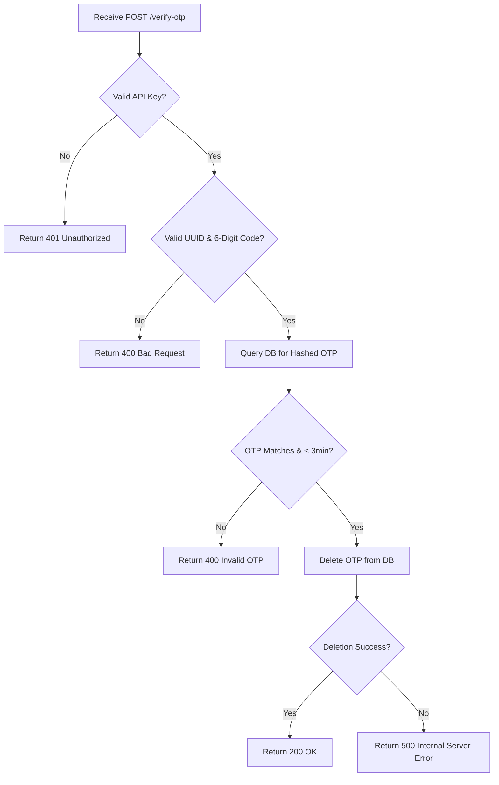

# OTP Send and Verify API

[](https://badge.fury.io/js/openlyne-otp)
[](https://python.org)
[](https://opensource.org/licenses/MIT)


Send and verify One-Time Passwords (OTPs) for user authentication using your API key.

> **SMS Provider**: Powered by [Africa's Talking](https://africastalking.com/)

## 🛡️ Security & Privacy

- **Data Protection**: Phone numbers and OTP codes are hashed before database storage
- **Encryption**: All API communications use TLS 1.2+
- **Retention**: OTP data is automatically deleted after verification or 3-minute expiry
- **Regional Support**: Available in all countries supported by Africa's Talking

## 💰 Pricing

**Pay-per-SMS**: Africa's Talking rates + 15% service fee
- **Sandbox**: Free for testing
- **Production**: Charged only for successfully delivered SMS
- View current SMS rates at [Africa's Talking Pricing](https://africastalking.com/pricing)

## Endpoints

### 1. Send OTP

- **URL**: `/send-otp`
- **Method**: `POST`
- **Headers**:
  - `x-api-key`: Your API key

**Body**:
- `phone`: Phone number with country code (e.g., `256700123456`)
- `uid`: User ID (a UUID like `123e4567-e89b-12d3-a456-426614174000`)
- `env`: (optional) Use `"sandbox"` for testing; leave it out for live mode

**What it does**: Sends a 6-digit OTP to the phone and saves it with the uid.

#### Example Request:
```bash
curl -X POST https://openlyne.sliplane.app/webhook/send-otp \
  -H "x-api-key: your_api_key" \
  -H "Content-Type: application/json" \
  -d '{"phone": 256700123456, "uid": "123e4567-e89b-12d3-a456-426614174000", "env": "sandbox"}'
```

#### Responses:

- **200 OK**: OTP sent!
  ```json
  {
    "success": true,
    "data": {
      "status": "Sent",
      "number": "256700123456"
    },
    "message": "OTP sent successfully",
    "error": null
  }
  ```

- **400 Bad Request**: Check your phone or uid
- **401 Unauthorized**: Wrong API key
- **429 Too Many Requests**: Wait 30 seconds before trying again
- **500 Internal Server Error**: Something went wrong on our end

### 2. Verify OTP

- **URL**: `/verify-otp`
- **Method**: `POST`
- **Headers**:
  - `x-api-key`: Your API key

**Body**:
- `uid`: User ID (same UUID as before)
- `code`: The 6-digit OTP you received

**What it does**: Checks if the OTP matches and is within 3 minutes. If valid, it's deleted.

#### Example Request:
```bash
curl -X POST https://openlyne.sliplane.app/webhook/verify-otp \
  -H "x-api-key: your_api_key" \
  -H "Content-Type: application/json" \
  -d '{"uid": "123e4567-e89b-12d3-a456-426614174000", "code": "123456"}'
```

#### Responses:

- **200 OK**: OTP verified!
  ```json
  {
    "success": true,
    "data": {
      "message": "OTP verified successfully",
      "contact_value": "256700123456"
    },
    "message": "Verification successful",
    "error": {}
  }
  ```

- **400 Bad Request**: OTP is wrong or expired
- **401 Unauthorized**: Wrong API key
- **500 Internal Server Error**: Something went wrong on our end

## Quick Tips

- Always include your API key in the `x-api-key` header
- `phone` needs a country code (e.g., 256 for Uganda)
- `uid` must be a valid UUID
- OTPs expire after 3 minutes
- You can only request a new OTP every 30 seconds for the same uid
- Use `"env": "sandbox"` in the Send OTP body for testing, or skip it for real SMS

### Testing in Sandbox Mode

Use the [Africa's Talking Phone Simulator](https://simulator.africastalking.com/simulator) for testing:
1. Set `"env": "sandbox"` in Send OTP requests
2. View messages in the simulator with any valid phone number format

## Code Examples

Below are examples of how to use the API in Python and JavaScript. Replace `YOUR_API_KEY` with your actual API key.

<details>
<summary>🐍 Python Example</summary>

```python
import requests
import json

# Base URL for your n8n instance
BASE_URL = "https://openlyne.sliplane.app/webhook"
API_KEY = "YOUR_API_KEY"
HEADERS = {"x-api-key": API_KEY, "Content-Type": "application/json"}

def send_otp(phone, uid, env="sandbox"):
    url = f"{BASE_URL}/send-otp"
    data = {"phone": phone, "uid": uid, "env": env}
    try:
        response = requests.post(url, headers=HEADERS, json=data)
        response.raise_for_status()
        return response.json()
    except requests.RequestException as e:
        return {"error": str(e)}

def verify_otp(uid, code):
    url = f"{BASE_URL}/verify-otp"
    data = {"uid": uid, "code": code}
    try:
        response = requests.post(url, headers=HEADERS, json=data)
        response.raise_for_status()
        return response.json()
    except requests.RequestException as e:
        return {"error": str(e)}

# Example usage
phone = 256700123456
uid = "123e4567-e89b-12d3-a456-426614174000"
print(send_otp(phone, uid))  # Sends OTP
print(verify_otp(uid, "123456"))  # Verifies OTP
```

</details>

<details>
<summary>🔥 JavaScript Example</summary>

```javascript
const BASE_URL = "https://openlyne.sliplane.app/webhook";
const API_KEY = "YOUR_API_KEY";
const HEADERS = {
  "x-api-key": API_KEY,
  "Content-Type": "application/json"
};

async function sendOTP(phone, uid, env = "sandbox") {
  try {
    const response = await fetch(`${BASE_URL}/send-otp`, {
      method: "POST",
      headers: HEADERS,
      body: JSON.stringify({ phone, uid, env })
    });
    return await response.json();
  } catch (error) {
    return { error: error.message };
  }
}

async function verifyOTP(uid, code) {
  try {
    const response = await fetch(`${BASE_URL}/verify-otp`, {
      method: "POST",
      headers: HEADERS,
      body: JSON.stringify({ uid, code })
    });
    return await response.json();
  } catch (error) {
    return { error: error.message };
  }
}

// Example usage
const phone = 256700123456;
const uid = "123e4567-e89b-12d3-a456-426614174000";
sendOTP(phone, uid).then(console.log); // Sends OTP
verifyOTP(uid, "123456").then(console.log); // Verifies OTP
```

</details>

---

**Replace `YOUR_API_KEY` with your actual API key. You're ready to go! 🚀**

## 📊 System Architecture

<details>
<summary>🔄 Data Flow Diagrams</summary>

Below are flowcharts showing the workflows for the Send OTP and Verify OTP endpoints. The Send OTP process includes a step to hash the OTP before saving it to the database for security.

### Send OTP Flowchart

```mermaid
graph TD
    A[Receive POST /send-otp] --> B{Valid API Key?}
    B -->|No| C[Return 401 Unauthorized]
    B -->|Yes| D{Valid Phone & UUID?}
    D -->|No| E[Return 400 Bad Request]
    D -->|Yes| F[Check DB for OTP]
    F --> G{Recent OTP < 30s?}
    G -->|Yes| H[Return 429 Too Many Requests]
    G -->|No| I[Generate OTP]
    I --> J[Hash OTP]
    J --> K{Env = Sandbox?}
    K -->|Yes| L[Send SMS via Sandbox]
    K -->|No| M[Send SMS via Production]
    L --> N[Save Hashed OTP to DB]
    M --> N
    N --> O{SMS & DB Success?}
    O -->|Yes| P[Return 200 OK]
    O -->|No| Q[Return Error (e.g., 500)]
```

### Verify OTP Flowchart



### Notes on Security
- The OTP is hashed before being stored in the database to enhance security
- During verification, the provided OTP is hashed and compared with the stored hash
- All data is validated within the 3-minute validity period

</details>

## 📞 Support

- **Documentation Issues**: Create an issue in this repository
- **API Support**: Contact via your dashboard
- **Status Updates**: Check our status page for service updates

## 📋 Terms & Limits

- **Rate Limiting**: 1 OTP per UID every 30 seconds
- **OTP Validity**: 3 minutes from generation
- **Usage Policy**: Fair use policy applies
- **SLA**: 99.9% uptime commitment
